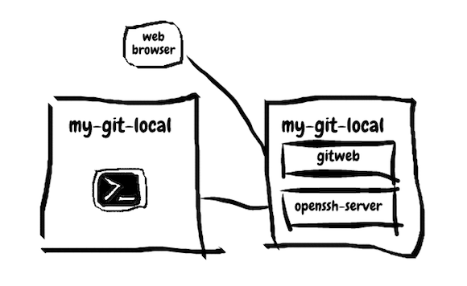

## MorningSpace Lab

[](https://morningspace.github.io)

# Hello Git

Keywords: Git, GitWeb, Docker, SSH

## Overview

This is the lab project to demonstrate how to play with git.

This lab project is entirely based on Docker technology. You can play it in a sandbox at your local, which is composed by a couple of Docker containers.

As the figure depicted below, there is one container working as local git, `my-git-local`, which is the container built from the image `morningspace/lab-git-local`. You can run git commands from command line in this container.

The other container working as remote git, `my-git-remote`, which is the container built from the image `morningspace/lab-git-remote`. Both openssh-server and gitweb are installed. So, you can either talk to `my-git-remote` via SSH from the command line within `my-git-local`, or HTTP from browser in your host machine.



Please check the below instructions to learn how to play it.

For more lab projects from MorningSpace Lab, please check [morningspace.github.io](https://morningspace.github.io).

## Instructions

### Build or Pull Docker Images

Go to the project root directory, and build docker images for both remote git and local git:
```shell
docker build -f docker/git-remote/Dockerfile -t morningspace/lab-git-remote .
docker build -f docker/git-local/Dockerfile -t morningspace/lab-git-local .
```

The docker images have also been pushed to Docker Hub. So, you can also pull them from there.
```
docker pull morningspace/lab-git-remote
docker pull morningspace/lab-git-local
```

### Launch Remote and Local Git

Launch one docker container for the image `morningspace/lab-git-remote` as remote git, and one docker container for the image `morningspace/lab-git-local` as local git:
```
docker run -it --name my-git-remote --hostname my-git-remote --net=lab -p 8080:80 morningspace/lab-git-remote
docker run -it --name my-git-local --hostname my-git-local --net=lab morningspace/lab-git-local
```

Note:
* Make sure the network `lab` has been created beforehand by running below command:
```
docker network create lab
```

### Add Pubic Key

To connect to the remote git from your local git, you need to generate SSH key and add the public key to the remote git.

The image `morningspace/lab-git-local` has already created a default one for you. After launch the local git, you will see the welcome message with the public key output to the terminal. Copy the key and login to the remote git using `root:password`:
```
ssh root@my-git-remote
```

Add the key to /home/git/.ssh/authorized_keys:
```
echo <your_public_key> >> /home/git/.ssh/authorized_keys
```

### Clone Your First Git Repository

After the public key is added, you should be able to connect to the remote git using git commands from command line in your local git.

The image `morningspace/lab-git-remote` has already created a sample git repository called `hello-git.git` for you. Now, you can clone your first git repository in your local git container, say in your home directory:
```
cd
git clone git@my-git-remote:~/hello-git.git
```

### Play with Your Git Repository

Let's play a bit more with your git repository.

Create `README` as below:
```
echo hello git! > README
```

Then push the change to remote git:
```
git add .
git commit -m 'Init commit'
git push origin master
```

You can do more as you wish. e.g. try branch, tag, etc.

### View Your Git Repository Using GitWeb

To open GitWeb from your host machine, input the below URL in browser: http://localhost:8080/gitweb

### Run Git Shell Commands

The image `morningspace/lab-git-remote` has pre-installed a couple of git shell commands that you can try.

Login to the remote git via SSH using `git` user.
```
ssh git@my-git-remote
```

It then lists all the commands available to you:

* create: Create an empty git repository in the remote git.
* list: List all existing git repositories in the remote git.
